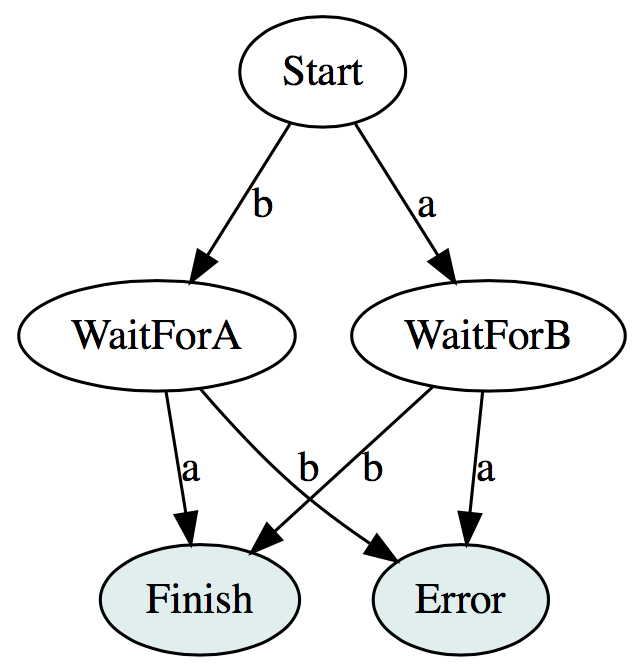

# 异步编程与Scala

<!--
Author: zhange
Email: zhange.zzg@gmail.com
create time: 2017-02-19 14:21:03
tags: [-]
description: -
-->

**注意：**本文内容来源于书籍、博客、官方文档等的翻译、整理、摘抄，仅供个人学习交流禁止转载，如有侵权请联系删除！

[TOC]

[翻译自：Asynchronous Programming and Scala](https://alexn.org/blog/2017/01/30/asynchronous-programming-scala.html)

现在随处可见异步性的身影，同时它也被包括在并发性之内。这篇文章解释了什么是异步处理和它面临的挑战。

## 1. 介绍

它作为一个比*多线程*更加综合的概念，但是人们往往将二者混淆。如果需要一种关系来表示，可以是这样：

```scala
Multithreadiing <: Asynchrony
```

我们可以将异步计算表示成一个`type`：

```scala
type Async[A] = (Try[A] => Unit) => Unit
```

如果这些`Unit`返回类型看起来很丑陋，那是因为异步本身就是丑陋的。一个异步计算可以是网络中拥有如下特征的任何任务(Task)、线程、进程或节点：

- 在你程序的主流程之外执行，或者从调用者的角度来看，它并不在当前调用栈(call-stack)执行；
- 接收一个回调，并在结果处理完成之后调用；
- 它不能对结果在何时发送做出任何保证，甚至一点也不能保证一个结果会不被发送。

知道异步属于*并发*的范畴是很重要的，但多线程则没必要。要记得在 Javascript 中，大部分 I/O 操作都是异步的，甚至繁重的业务逻辑也被异步化处理(使用基于调度的 setTimeout)以保证接口是可响应的。但是并不涉及内核级别的多线程，Javascript 成了一个 N:1 的多线程化平台。

将异步化引入到程序中的同时也意味着你要面对并发问题，因为你无法知道异步计算具体何时会完成。因此，将多个异步计算的结果组合并在同一时间运行意味着你需要进行额外的同步操作，因此你也不能再依赖顺序。不能依赖顺序则会带来更多的不确定性。

> 维基百科：一个不确定的算法，相对于确定性的算法来说，尽管提供了相同的输入，可能会在不同的运行过程表现出不同的行为。一个并行算法因为竟态条件会在多次运行时以不同的方式执行。


敏锐的读者可以会注意到这些类型随处可见，基于用例和规约做一些调整：

- [Observer pattern](https://en.wikipedia.org/wiki/Observer_pattern)- [Gang of Four](https://en.wikipedia.org/wiki/Design_Patterns)
- Scala 中的`Future`，由其抽象方法`onComplete`定义
- Java 中的[ExecutorService.submit(Callable)](https://docs.oracle.com/javase/8/docs/api/java/util/concurrent/ExecutorService.html#submit-java.util.concurrent.Callable-)
- Javascript 汇总的[EventTarget.addEventListener](https://developer.mozilla.org/en-US/docs/Web/API/EventTarget/addEventListener)
- 在 Akka 的 actor 中，尽管给出的回调被`sender()`替换
- Monix 中的[Task.Async](https://github.com/monix/monix/blob/v2.2.1/monix-eval/shared/src/main/scala/monix/eval/Task.scala#L1253)定义
- Monix 中的 [Observable](https://monix.io/api/2.2/monix/reactive/Observable.html)、[Observer](https://monix.io/api/2.2/monix/reactive/Observer.html)对
- [Reactive Streams](http://www.reactive-streams.org/reactive-streams-1.0.0-javadoc/)的详细说明

这些抽象有什么共同点呢？他们都提供了处理异步化的方式，其中一些更为优秀。

## 2. 巨大的错觉

我们喜欢假装能将函数的异步结果转换为同步：

```scala
def await[A](fa: Async[A]): A
```

问题的实质是我们不能假装这些异步处理与普通函数相同。如果你对此需要一刻，只需要了解一下为什么 CORBA 失败了。

针对异步处理，我们有以下非常常见的分布式计算谬误( [fallacies of distributed computing](https://en.wikipedia.org/wiki/Fallacies_of_distributed_computing))：

- 网络是可靠的
- 延迟为 0
- 带宽是无限的
- 网络是完全的
- 拓扑结构不会发生变化
- 拥有一位管理员
- 传输消耗为 0
- 网络是同质的(homogeneous)

当然这些没有一条是真的。这意味着代码是按这些情形来编写的：极少的网络错误处理，忽略了网络延迟和丢包，忽略了带宽限制和随之而来的诸多不确定性。

人们尝试各种方式来对付这些问题：

- 回调，导出都是对调，甚至忽略了基本问题。像 Javascript 中发生的一样，这导致了众所周知的*回调地域*，以程序员的汗水和鲜血为代价，甚至怀疑人生；
- 阻塞线程，基于[1:1 (kernel-level) multithreading](https://en.wikipedia.org/wiki/Thread_(computing)#1:1_.28kernel-level_threading.29)平台
- [first-class continuations](https://en.wikipedia.org/wiki/Continuation)，比如 Scheme 中实现的[call/cc](https://en.wikipedia.org/wiki/Call-with-current-continuation)，在任何一点上保存执行状体并在程序的稍后点回到该点的能力；
- 来之 C# 的`async`/`await`语言扩展，同样在[scala-async](https://github.com/scala/async)、最新的[ECMAScript](https://developer.mozilla.org/en-US/docs/Web/JavaScript/Reference/Statements/async_function)也有实现；
- 有运行时管理的[Green threads](https://en.wikipedia.org/wiki/Green_threads)，可能与 [M:N multithreading](https://en.wikipedia.org/wiki/Thread_(computing)#M:N_.28hybrid_threading.29)组合，来模拟异步动作的阻塞。比如 Golang 和 Haskell；
- Erlang 和 Akka 中实现了[actor model](https://en.wikipedia.org/wiki/Actor_model)，或者  [Clojure's core.async](https://github.com/clojure/core.async) 或 Golang 中的[CSP](https://en.wikipedia.org/wiki/Communicating_sequential_processes)；
- Monad 用于顺序和组合，比如 Haskell 的 [Async](https://hackage.haskell.org/package/async-2.1.1/docs/Control-Concurrent-Async.html)类型和 [IO](https://wiki.haskell.org/IO_inside)类型的组合，或者： [F# asynchronous workflows](https://docs.microsoft.com/en-us/dotnet/articles/fsharp/language-reference/asynchronous-workflows)、 [Scala's Futures and Promises](http://docs.scala-lang.org/overviews/core/futures.html)、[Monix Task](https://monix.io/docs/2x/eval/task.html) 或 [Scalaz Task](https://github.com/scalaz/scalaz/blob/scalaz-seven/concurrent/src/main/scala/scalaz/concurrent/Task.scala), 等等。

有这么多不同的实现，是因为没有任何一种是适用于通用目的的机制来处理异步。没有银弹的窘境在这里很切题，内存管理和并发成为我们开发者面临的巨大问题。

> 注意 - 个人观点和一些碎碎念：人们喜欢吹嘘像 Golang 这样的 M:N 平台，然而我更偏向于 1:1 的多线程平台，比如 JVM 或 .NET。
>
> 因为你可以在编程语言中基于 1:1 平台搭建 M:N 的多线程来提供足够的表现力(比如：Scala 的 Future、Task、Clojure 的 core.async 等等)，但是一旦 M:N 的运行时不再适用于你的场景，你则无法修改或替换平台。是的，大多数 M:N 平台都被一种方式或另一种打破。
>
> 真正的学习所有可行方案或做出选择是很痛苦的，但总比做出无知的选择要痛苦的少，TOOWTDI(?) 和 “worse is better”在这种情况下害处则会更大。人们在解释难于学习一门新的或更有表现力的语言时，比如 Scala 或 Haskell，往往没有提到点上，因为如果他们不得不处理并发问题，这是学习一种新的编程语言将会使他们最小的问题。我了解到一些人因为并发问题而离开了软件行业。

## 3. 回调地狱

让我们创建一个仿造的例子来阐明我们的疑问。比如开启两个异步处理并将他们的结果结合在一起。

首先定义一个异步执行的函数：

```scala
import scala.concurrent.ExecutionContext.global

type Async[A] = (A => Unit) => Unit

def timeTwo(n: Int): Async[Int] = {
  onFinish => {
    global.execute(new Runnable{
      def run():Unit = {
        val result = n * 2
        onFinish(result)
      }
    })
  }
}

// Usage
timesTwo(20) { result => println(s"Result: $result")}
// => Result: 40
```

### 3.1. 顺序化(副作用炼狱)

让我们来结合两个异步结果，以平滑的顺序让一个在另一个发生之后执行：

```scala
def timesFour(n:Int):Async[Int] = {
  onFinish => {
    timesTwo(n){ a =>
      timesTwo(n){ n =>
        // Combining the two results
        onFinish(a + b)
      }
    }
  }
}

// Usage
timesFour(20) { result => println(s"Result: $result")}
// => Result: 80
```

看起来很简单，但是我们仅结合了两个结果，一个跟在另一个之后。

巨大的问题仍然是**它触及到的所有异步化副作用**。我们假设由于参数的缘故我们以一个纯函数开始：

```scala
def timesFour(n:Int):Int
```

但是这是你的企业架构师听说了这些企业 JavaBean 和 a lap dance(?)，决定让你基于这些异步的`timsTwo`函数。这时我们的`timesFour`实现从一个精确的纯函数编程一个有副作用的函数。同时伴随一个并不成熟的`Async`类型，我们需要面对在整个管道(pipeline)处理副作用。同时，阻塞结果也没有任何帮助，你只是隐藏了问题所在(第二节所述)。

但是等等，事情还会变得更糟。

### 3.2. 并行化(梦境中的不确定性)

第二个调用并不基于第一个调用，因此他们可以并行运行。在 JVM 我们可以并行运行 CPU-bound 的任务，但这并不适用于 Javascript，我们可以发起 Ajax 请求或于其他网页工作者(web worker)交谈。

不幸的是事情会变的有点复杂。首先使用所有自然(navie)方式来做都会非常错误：

```scala
// REALLY BAD SAMPLE

def timesFourInParallel(n:Int):Async[Int] = {
  onFinish => {
    var cacheA = 0
    
    timesTwo(n) { a => cacheA = a}
    
    timesTwo(n) { b =>
      // Combing the two results
      onFinish(cacheA + b)
    }
  }
}

timesFourInParallel(20) {result => println(s"Result: $result")}
// => Result: 80

timesFourInParallel(20) {result => println(s"Result: $result")}
// => Result: 40
```

这里的例子展示了实际中的不确定性。我们得不到顺序保证哪个会先结束，因此如果我们要并行执行，需要建模一个迷你状态机来进行同步。

首先，定义 ADT 来描述状态机：

```scala
// Define the state machine
sealed trait State
// Initial state
case object Start extends State
// We got a B, waiting for an A
final case class WaitForA(b:Int) extends State
// We got a A, waiting for a B
final case class WaitForB(a:Int) extends State
```

然后以异步的方式来演化这个状态机：

```scala
// BAD SAMPLE FOR THE JVM(only works for Javascript)

def timesFourInParallel(n:Int):Async[Int] = {
  onFinish => {
    var state:State = Start
    
    timesTwo(n) { a =>
      state match {
        case Start => state = WaitForB(a)
        case WaitForA(b) => onFinish(a + b)
        case WaitForB(_) => 
          // Can't be caught b/c async, hopefully it gets reported
          throw new IllegalStateException(state.toString)
      }
    }
    
    timesTwo(n) { b =>
      state match {
        case Start => state = WaitForA(b)
        case WaitForB(a) => onFinish(a + b)
        case WaitForA(_) => 
          // Can't be caught b/c async, hopefully it gets reported
          throw new IllegalStateException(state.toString)
      }
    }
  }
}
```

为了更好的视觉化我们处理的问题，下图是状态机：



但是等等，我们还没结束，因为 JVM 拥有真实的 1:1 多线程，这表示我们要沉浸于*可共享内存的并行化*，因此对`state`的访问必须是同步的。

一种方案是使用`synchronized`块，或称为*intrinsic*块：

```scala
// We need a common reference to act as our monitor
val lockkk = new AnyRef
var state:State = Start

timeTwo(n) { a =>
  lock.synchronized{
    state match {
      case Start =>
        state = WaitForB(a)
      case WaitForA(b) =>
        onFinish(a + b)
      case WaitForB(_) =>
        // Can't be caught b/c async, hopefully it gets reported
        throw new IllegalStateException(state.toString)
    }
  }
}

// ...
```

这种高级别的锁保护资源(eg. state)不被多线程并行访问。但我个人更倾向于避免这种高级别的锁，因为内核的调度器可以以任何原因冻结任何线程，包括持有锁的线程。冻结一个持有锁的线程意味着如果你想保证持续前进，而其他线程无法再继续前进，这是无阻塞([non-blocking](https://en.wikipedia.org/wiki/Non-blocking_algorithm))的逻辑则会更优先。

因此供替代的方式是使用一个[AtomicReference](https://docs.oracle.com/javase/8/docs/api/java/util/concurrent/atomic/AtomicReference.html)，它会更适用这个场景：

```scala
// CORRECT VERSION FOR JVM

import scala.annitation.tailrec
import java.util.concurrent.atomic.AtomicReference

def timeFourInParallel(n:Int):Async[Int] = {
  onFinish =>{
    val state = new AtomicReference[State](Start)
    
    @tailrec def onValueA(a:Int):Unit = {
      state.get match{
        case Start => 
          if(!state.compareAndSet(Start, WaitForB(a))) onValue(a) // retry
        case WaitForA(b) => onFinish(a + b)
        case WaitForB(a) => throw new IllegalStateException(state.toString)
      }
    }
    
    timesTwo(n)(onValueA)
    
    @tailrec def onValueB(b:Int):Unit = {
      state.get match {
        case Start =>
          if (!state.compareAndSet(Start, WaitForA(b)))
            onValueB(b) // retry
        case WaitForB(a) =>
          onFinish(a + b)
        case WaitForA(_) =>
          // Can't be caught b/c async, hopefully it gets reported
          throw new IllegalStateException(state.toString)
      }
    }
    
    timesTwo(n)(onValueB)
  }
}
```

> **PRO-TIP**：如果你想编写  Javascript / Scala.js 的交叉编译代码，基于性能调整和用于操作原子引用的酷炫工具类，可以尝试[Monix](https://monix.io/)中的[Atomic](https://monix.io/docs/2x/execution/atomic.html)。

### 3.3. 递归(爆栈的愤怒)

如果我告诉你上面的`onFinish`调用并非栈安全(stack-unsafe)的，同时当你调用它时也不会强制*异步边界(asynchronous boundary)*，这时你的程序会因为一个`StackOverflowError`爆炸，又该怎么办呢？

你不应该相信为的话。首先让我们找些乐子，同时以更通用的方式来定义上面的操作：

```scala
import scala.annotation.tailrec
import java.util.concurrent.atomic.AtomicReference

type Async[+A] = (A => Unit) => Unit

def mapBoth[A,B,R](fa:Async[A], fb:Async[b])(f:(A,B) => R): Async[R] = {
  // Defines the state machine
  sealed trait State[+A,+B]
  // Initial state
  case object Start extends State[Nothing, Nothing]
  // We got a B, waiting for an A
  final case class WaitForA[+B](b:B) extends State[Nothing, B]
  // We got an A, waiting for a B
  final case class WaitForB[+A](a:A) extends State[A, Nothing]
  
  onFinish =>{
    val state = new AtomicReference[State[A,B]](Start)
    
    @tailrec def onVlueA(a:A):Uint = {
      state.get match {
        case Start => 
          if(!state.compareAndSet(Start, WaitForB(a))) onValue(a) //retry
        case WaitForA(b) => onFinish(f(a,b))
        case WaitForB(a) =>
          throw new IllegalStateException(state.toString)
      }
    }
    
    @tailrec def onValueB(b:B):Unit = {
      state.get match{
        case Start =>
          if (!state.compareAndSet(Start, WaitForA(b)))
            onValueB(b) // retry
        case WaitForB(a) => onFinissh(f(a,b))
        case WaitForA(b) => 
          throw new IllegalStateException(state.toString)
      }
    }
    
    fa(onValueA)
    fb(onValueB)
  }
}
```

现在可以定义一个类似 Scala 中的`Future.sequence`操作，因为我们的意志坚强，勇气不可估量.....

```scala
def sequence[A](list:List[Async[A]]):Async[List[A]] = {
  @tailrec def loop(list:List[Async[A]], acc:Async[List[A]]): Async[List[A]] = {
    list match {
      case Nil =>
        onFinish => acc(r => onFinish(r.reverse))
      case x :: xs =>
        val update = mapBoth(x, acc)(_ :: _)
        loop(xs, update)
    }
  }
  
  vall empty:Async[List[A]] = _(Nil)
  loop(list, empty)
}

// Invocation
sequence(List(timesTwo(10), timesTwo(20), timesTwo(30))) {r =>
  println(s"Result: $r")
}
// => Result: List(20, 40, 60)
```

你一定认为我们完成了？

```scala
val list = 0.until(10000).map(timesTwo).toList
sequence(list)(r => println(s"Sum: ${r.sum}"))
```

注意看这个壮丽的内存错误，它会让你的程序在生产环境崩溃，被认为是一个致命错误，因此 Scala 的`NonFatal`也捕捉不到：

```scala
java.lang.StackOverflowError
  at java.util.concurrent.ForkJoinPool.externalPush(ForkJoinPool.java:2414)
  at java.util.concurrent.ForkJoinPool.execute(ForkJoinPool.java:2630)
  at scala.concurrent.impl.ExecutionContextImpl$$anon$3.execute(ExecutionContextImpl.scala:131)
  at scala.concurrent.impl.ExecutionContextImpl.execute(ExecutionContextImpl.scala:20)
  at .$anonfun$timesTwo$1(<pastie>:27)
  at .$anonfun$timesTwo$1$adapted(<pastie>:26)
  at .$anonfun$mapBoth$1(<pastie>:66)
  at .$anonfun$mapBoth$1$adapted(<pastie>:40)
  at .$anonfun$mapBoth$1(<pastie>:67)
  at .$anonfun$mapBoth$1$adapted(<pastie>:40)
  at .$anonfun$mapBoth$1(<pastie>:67)
  at .$anonfun$mapBoth$1$adapted(<pastie>:40)
  at .$anonfun$mapBoth$1(<pastie>:67)
```

如为所说，`onFinish`作为一个没有*强制异步边界*的调用会引起栈溢出错误。在 Javascript 中可以通过调度`setTimeout`来解决，而 JVM 则需要一个线程池或 Scala 的`ExecutionContext`。

Are you feeling the fire yet? 🔥

## 4. Future * Promise

`scala.concurrent.Future`描述了完整的异步求值计算，和我们上面用的`Async`有点类似。

> 维基百科：Future 和 Promise 是在一些并发编程语言中用于异步程序执行的结构。它描述了一个对象，该对象看做是最初并不可知的结果的代理，通常因为该结果的值尚未计算完成。

> 作者的碎碎念：`docs.scala-lang.org`中关于 [Futures and Promises](http://docs.scala-lang.org/overviews/core/futures.html)是这样说的，“Future 提供了一个以并行方式执行多个操作的方法 -更加高效、无阻塞的方式。 ”这种说法容易产生误解，一个混淆的源头。
>
> `Future`描述的是异步化而非并行化。当然，可以以并行的方式来使用，但并不意味者仅用作并行(async != Parallelism)，或适用于那些寻找充分利用 CPU 容量的人，使用`Future`可以证明是昂贵和不明智的，因为在有些场景它会出现性能问题，参考本部分的第四小节。

`Future`是一个定义了两种主要操作的接口，同时附带一些基于这些主要操作实现的组合子：

```scala
import scala.util.Try
import scala.concurrent.ExecutionContext

trait Future[+T] {
  // abstract
  def value:Option[Try[T]]
  
  // abstract
  def onComplete(f:Try[T] => Unit)(implicit ec:ExecutionContext):Unit
  
  // Transforms values
  def map[U](f: T => U)(implicit ec:ExecutionContext):Future[U] = ???
  // Sequencing
  def flatMap[U](f: T => Future[U])(implicit ec:ExecutionContext):Future[U] = ???
}
```

`Future`的特性：

- [Eagerly evaluated](https://en.wikipedia.org/wiki/Eager_evaluation)(立即求值，strict and not lazy)，意味着一旦调用者收到一个`Future`引用，无论异步处理要完成的是什么，它都已经开始了；
- [Memoized](https://en.wikipedia.org/wiki/Memoization)(记忆，cached)，因为会被*立即求值*，它的行为更像一个正常值而不是一个函数，同时最终的结果会对所有的监听者(listener)可用。`value`的目的是用于返回记忆结果或尚未完成时返回`None`。Goes 并未提到会返回一个不确定的值；
- 流经(stream)单个结果时它会显示，因为是记忆化起了作用。因此当监听者注册了完成时，他们最多会被调用一次。

`ExecutionContext`的解释性说明：

- `ExecutionContext`管理异步执行，也可以把它视作一个线程池，但它并非必须是一个线程池(因为异步不等于多线程或并发)；
- `onComplete`和我们上面定义的`Async`类型一样，然而，它需要一个`ExecutionContext`，因为所有的完成时回调需要以异步的方式调用；
- 所有的组合子和工具类都基于`onComplete`实现，因此所有的组合子和工具类都要提供一个`ExecutionContext`参数。

如果你不理解为什么这些签名都需要一个`ExecutionContext`，回到上面的“递归”部分，直到你完全理解了。

### 4.1. 顺序化

让我们使用`Future`重新定义“回调地狱”部分的函数：

```scala
import scala.concurrent.{Future, ExecutionContext}

def timesTwo(n:Int)(implicit ec:ExecutionContext):Future[Int] = Future(n * 2)

// Usage
{
  import scala.concurrent.ExecutionContext.Implicits.global
  timesTwo(20).onComplete{ result => println(s"Result: $result")}
  // => Result: Success(40)
}
```

足够简单，`Future.apply`创建器使用提供的`ExecutionContext`执行给出的计算。因此在 JVM 上，假设`global`执行上下文会运行在不同的线程上。

然后实现顺序化：

```scala
def timesFour(n:Int)(implicit ec:ExecutionContext):Future[Int] = 
  for{
    a <- timesTwo(n)
    b <- timesTwo(n)
  } yield a + b

// Usage
{
  import scala.concurrent.ExecutionContext.Implicits.global
  timesFour(20).onComplete {result => println(s"Result: $result")}
  // => Result: Success(80)
}
```

足够简单。这里的*for 表达式*魔法仅仅是会被转换为`flatMap`和`map`，在字面上等同于：

```scala
def timesFour(n:Int)(implicit ec:ExecutionContext):Future[Int]={
  timesTwo(n).flatMap{ a=>
    timesTwo(n).map{ b=>
      a + b
    }
  }
}
```

如果你在项目中导入了[scala-async](https://github.com/scala/async)，可以像下面这样实现：

```scala
import scala.async.Async.{async, await}

def timesFour(n:Int)(implicit ec:ExecutionContext):Future[Int]={
  async{
    val a = await(timesTwo(n))
    val b = await(timesTwo(n))
    a + b
  }
}
```

扩展库`scala-async`由 macros 驱动，并将你的代码转换为`flatMap`和`map`调用。因此，`await`并不会阻塞线程，尽管它带来了这种错觉。

这些看起来确实不错，不幸的是拥有很多限制。当你的`await`处于匿名函数之内时，库将无法“重写”你的代码，不幸的是 Scala 代码中到处都是这种表达式。这将不会工作：

```scala
// BAD SAMPLE
def sum(list:List[Future[Int]])(implicit ec:ExecutionContext):Future[Int] = {
  async{
    var sum = 0
    // Nope, not going to work because "for" is translated to "foreach"
    for(f <- list){
      sum += await(f)
    }
  }
}
```

这种方式带来了拥有*first-class continuations*的幻觉，但是这种扩展并非一等类，仅仅是作为由编译器管理的重写代码。使得，这种约束在 C# 和 ECMAScript 中却应用的很好，因为`async`代码并不严重依赖于*函数式*。

还记得我前面的碎碎念中提到的*没有银弹*？

### 4.2. 并行化

像先前的例子中展示的，这两个函数互相独立，因此我们可以并行调用他们。使用`Future`则会更加简单，尽管求值语义对于新手来说会有点迷惑：

```scala
def timesFourInParallel(n:Int)(implicit ec:ExecutionContext):Future[Int] = {
  // Future is eagerly evaluated, so this will trigger the
  // execution of both before the composition happens.
  val fa = timesTwo(n)
  val fb = timesTwo(n)
  
  for{
    a <- fa
    b <- fb
  } yield a + b
  // fa.flatMap(a => fb.map(b => a + b))
}
```

这会有点迷惑，领新手措手不及。因为在这种执行模型中，为了以并行的方式执行，你需要在组合发生之前初始化这些`Future`引用。

一种可替代的方式是使用`Future.sequence`，可以用于任意集合：

```scala
def timesFourInParallel(n:Int)(implicit ec:ExecutionContext):Future[Int] = 
  Future.sequence(timesTwo(n) :: timesTwo(n) :: Nil).map(_.sum)
```

这种用法估计也会让新手吃惊，因为这些`Future`仅会当传入`sequence`的集合是精确的时候才会以并行的方式执行，不像 Scala 的`Stream`或`Iterator`。显然这个名字是个误称。

### 4.3. 递归

`Future`类型对于递归操作是绝对安全的，因为信心在于执行回调的`ExecutionContext`。因此重试前面的例子：

```scala
def mapBoth[A,B,R](fa:Future[A], fb:Future[B])(f:(A,B) => R)(implicit ec:...) = {
  for{
    a <- fa
    b <- fb
  } yield f(a,b)
}

def sequence[A](list:List[Future[A]])(implicit ec:...):Future[List[A]] = {
  val seed = Future.successful(List.empty[A])
  list.foldLeft(seed)((acc,f) => for(1 <- accl; a <- f) yield a :: l).map(_.reverse)
}

// Invocation
{
  import scala.concurrent.ExecutionContext.Implicits.global
  sequence(List(timesTwo(10), timesTwo(20), times(30))).foreach(println)
  // => List(20, 40, 60)
}
```

这次则不会出现`StackOverflowError`:

```scala
val list = 0.until(10000).map(timesTwo).toList
sequence(list).foreach(r => println(s"Sum: ${r.sum}""))
```

### 4.4. 性能代价

`Future`的麻烦是每次调用`onComplete`都会使用一个`ExecutionContext`来执行，通常这意味着一个`Runnable`被发送到了线程池，像这样分支(fork)一个*逻辑线程*。如果你拥有 CPU 绑定的任务，这种实现细节对性能来说是一种灾难，因为跳跃的线程意味着 [context switches](https://en.wikipedia.org/wiki/Context_switch)，同时会带来 CPU 的[cache locality](https://en.wikipedia.org/wiki/Locality_of_reference)被摧毁。当然，该实现拥有确定性的优化，比如`flatMap`的实现中使用一个内部的蹦床形式的(trampolined?)执行上线文，为了避免在链接这些内部回调时进行分支，但是这还不够并且基准测试也不会说谎。

同时基于它的记忆化，在完成之上，实现会强制每个生产者执行一个`AtomicReference.compareAndSet`，在每个`Future`完成之前又会为每个注册的监听者加上一个`compareAndSet`。这些调用是十分昂贵的，所有这些都是为了记忆化以便在多个线程之间能够良好运行。

换句话说，如果你想让你的 CPU 绑定任务能够充分利用 CPU，这时使用`Future`和`Promise`不是一个好注意。

如果你想对比 Scala 的`Future`和`Task`实现，可以看一下相关[benchmark](https://github.com/rossabaker/benchmarks/pull/4):

```
[info] Benchmark                   (size)   Mode  Cnt     Score     Error  Units
[info] FlatMap.fs2Apply             10000  thrpt   20   291.459 ±   6.321  ops/s
[info] FlatMap.fs2Delay             10000  thrpt   20  2606.864 ±  26.442  ops/s
[info] FlatMap.fs2Now               10000  thrpt   20  3867.300 ± 541.241  ops/s
[info] FlatMap.futureApply          10000  thrpt   20   212.691 ±   9.508  ops/s
[info] FlatMap.futureSuccessful     10000  thrpt   20   418.736 ±  29.121  ops/s
[info] FlatMap.futureTrampolineEc   10000  thrpt   20   423.647 ±   8.543  ops/s
[info] FlatMap.monixApply           10000  thrpt   20   399.916 ±  15.858  ops/s
[info] FlatMap.monixDelay           10000  thrpt   20  4994.156 ±  40.014  ops/s
[info] FlatMap.monixNow             10000  thrpt   20  6253.182 ±  53.388  ops/s
[info] FlatMap.scalazApply          10000  thrpt   20   188.387 ±   2.989  ops/s
[info] FlatMap.scalazDelay          10000  thrpt   20  1794.680 ±  24.173  ops/s
[info] FlatMap.scalazNow            10000  thrpt   20  2041.300 ± 128.729  ops/s
```

可以看到 [Monix Task](https://monix.io/docs/2x/eval/task.html)在 CPU 绑定的任务上击败了`Future`。

> 注意：这些基准测试是有局限的，仍然有一些用例中`Future`会更快(eg. Monix [Observer](https://monix.io/docs/2x/reactive/observers.html)使用`Future`用做背压)并且性能通常并不相关，比如执行 I/O，即那些吞吐并非 CPU 绑定的场景。

## 5. Task，Scala 的 IO Monad

…...